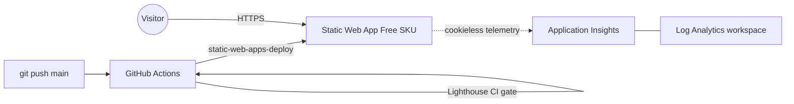

# Azure J3 — Static Web App + TLS + monitoring

A static **Astro** site shipped on **Azure Static Web Apps** (Free SKU): deployed by **GitHub Actions** on every push, served over auto-renewing **HTTPS**, hardened with strict **security headers**, instrumented with **Application Insights** (cookieless), and gated by a **Lighthouse CI** performance budget. Infrastructure is **Terraform**.

> Built as a hands-on learning project. This build uses the free `*.azurestaticapps.net` hostname; a section below shows how to add a custom domain + Azure DNS when you own one.

---

## Architecture



### Pipeline stages
```
push to main
  -> Build + Deploy   Azure/static-web-apps-deploy@v1 (Astro build -> dist -> SWA)
       -> Lighthouse CI   3-run median against the live hostname; perf/a11y/seo are hard gates
pull request
  -> Build + Deploy   publishes a throwaway preview URL (posted as a PR comment)
  -> Close PR         tears the preview down when the PR closes
```

---

## What gets created (Terraform)

| Resource | Name pattern | Notes |
|---|---|---|
| Resource group | `rg-j3-dev-weu-001` | standard tags |
| Static Web App | `swa-j3-dev-weu-001` | **Free** SKU, free managed TLS |
| Log Analytics | `log-j3-dev-weu-001` | 30-day retention |
| Application Insights | `ai-j3-dev-weu-001` | workspace-based, `web` type |

> A custom-domain build would also include an `azurerm_dns_zone` + records. Omitted here because it requires a domain you own — see "Adding a custom domain" below.

---

## Repository layout

```
site/
  src/pages/        index, projects, contact, 404 (Astro)
  src/layouts/      Base.astro (shared shell, accessible nav, dark mode)
  src/lib/          insights.ts (cookieless App Insights init, deferred load)
  public/           staticwebapp.config.json (security headers + 404 rewrite)
  astro.config.mjs  package.json  tsconfig.json
terraform/
  versions.tf providers.tf variables.tf locals.tf
  rg.tf swa.tf insights.tf outputs.tf example.tfvars
.github/
  workflows/deploy.yml   build + deploy + Lighthouse
  lighthouserc.json      score budgets
```

---

## Prerequisites

- An **Azure subscription** (Static Web Apps Free is genuinely free)
- [Terraform](https://developer.hashicorp.com/terraform/downloads) >= 1.9, [Azure CLI](https://learn.microsoft.com/cli/azure/install-azure-cli), [GitHub CLI](https://cli.github.com/), [Node.js](https://nodejs.org/) 20+
- A storage account for Terraform state

---

## Setup

### 1. Build the site locally
```powershell
cd site
npm install
npm run build      # emits dist/
```

### 2. Infrastructure
```powershell
cd ../terraform
cp example.tfvars terraform.tfvars   # edit project/owner if you like

terraform init `
  -backend-config="resource_group_name=<tfstate-rg>" `
  -backend-config="storage_account_name=<tfstate-sa>" `
  -backend-config="container_name=tfstate" `
  -backend-config="key=j3.tfstate"

terraform apply
```

### 3. GitHub secret + variables
```powershell
gh secret   set AZURE_STATIC_WEB_APPS_API_TOKEN  --body (terraform output -raw swa_api_key)
gh variable set APP_INSIGHTS_CONNECTION_STRING   --body (terraform output -raw ai_connection_string)
gh variable set SWA_HOSTNAME                      --body (terraform output -raw swa_default_hostname)
```
- The **deploy token** is a Static Web Apps deployment key (this is SWA's native deploy auth, not OIDC).
- The **App Insights connection string** is a *variable*, not a secret — it's embedded in client-side telemetry JS anyway and isn't sensitive.

### 4. Ship it
```powershell
git push origin main      # triggers build + deploy + Lighthouse
gh run watch
```

### 5. Verify
```powershell
$h = terraform -chdir=terraform output -raw swa_default_hostname
curl.exe -sI "https://$h/"     # check the security headers
```
Then paste the hostname into [securityheaders.com](https://securityheaders.com) — should grade **A/A+**.

### 6. Tear down (optional)
```powershell
terraform -chdir=terraform destroy
```
> Cost is ~€0 (Free SWA + App Insights under the free tier), so you can leave it running.

---

## Adding a custom domain (when you own one)

This build skips it, but the full version is a small addition:

1. Add an `azurerm_dns_zone` for your domain and point your registrar's nameservers at the zone's `name_servers`.
2. Validate the domain on the SWA (`az staticwebapp hostname set ... --validation-method dns-txt-token`), add the TXT record, then an apex **alias A record** (`target_resource_id` = the SWA) and a `www` CNAME to the default hostname.
3. SWA provisions a free managed certificate (~5–15 min). `curl -vI https://yourdomain` then shows a valid DigiCert/Microsoft cert.

---

## Reusability — what to change

| Change | Where |
|---|---|
| Project / env / region / instance | `terraform/terraform.tfvars` (drives all names) |
| Site content & routes | `site/src/pages/*` |
| Security headers / redirects / 404 | `site/public/staticwebapp.config.json` |
| Lighthouse score budgets | `.github/lighthouserc.json` |
| Lighthouse target host | `SWA_HOSTNAME` GitHub variable |
| Custom domain | add `dns.tf` (see section above) |

---

## Security notes (reviewed before publishing)

- **No secrets in the repo.** `*.tfvars`, `*.tfstate`, and `backend.hcl` are gitignored; only `example.tfvars` ships. The provider lock file is committed for reproducibility.
- **Strict security headers** via `staticwebapp.config.json`: HSTS (preload), a tight CSP, `X-Content-Type-Options: nosniff`, `Referrer-Policy`, `Permissions-Policy`, and `X-Frame-Options: DENY`. Grades A/A+ on securityheaders.com.
- **HTTPS everywhere** — SWA auto-redirects `http -> https` and issues a free managed certificate.
- **Cookieless analytics** — App Insights runs with `disableCookiesUsage`, so there are no tracking cookies (no consent banner needed) and a cleaner privacy posture.
- **The App Insights connection string is not a secret** — it only authorizes telemetry *ingestion*, and the browser SDK exposes it by design.

---

## Best practices demonstrated

- **Static-first hosting** — no servers to patch; the attack surface is just static files + headers.
- **Security headers as code** — the hardening lives in the repo and ships with every deploy.
- **Performance budget in CI** — Lighthouse gates Performance/Accessibility/SEO so a regression fails the build.
- **Pragmatic gating** — third-party SDKs (App Insights) trip Lighthouse "best-practices" (deprecated APIs / console noise), so that category is a **warning**, not a hard gate, while the others stay strict. Knowing *which* gates to enforce is the skill.
- **Deferred third-party loading** — telemetry loads on `requestIdleCallback`, so it never blocks first paint (kept Performance at 100).
- **Build-time configuration injection** — the connection string is passed as a `PUBLIC_` env var at build, not committed.

### Build-it-from-scratch path (if you're learning)

1. **Site first.** Scaffold an Astro site with 3 routes + a 404; get `npm run build` producing `dist/` cleanly.
2. **Headers.** Add `staticwebapp.config.json` with HSTS/CSP/etc.; understand each directive.
3. **Infra.** Terraform the Static Web App + Log Analytics + Application Insights.
4. **Deploy.** Wire `Azure/static-web-apps-deploy@v1` with the deploy token; push and watch it go live.
5. **Quality gate.** Add Lighthouse CI; tune budgets to reality (free-tier TTFB varies — use a multi-run median).
6. **Telemetry.** Add cookieless App Insights, loaded deferred; verify real page views land (test in a real browser — `curl` won't fire client JS, and the CSP must allow `js.monitor.azure.com`).

> Two gotchas worth internalizing: a CSP that's too strict silently blocks your analytics SDK (check the browser console), and a single 186 KB analytics bundle will tank your Lighthouse score unless you defer it.

---

## Real-world scenarios where this pattern applies

- **Portfolio / resume / docs / marketing sites** — zero-cost, globally distributed, auto-TLS.
- **Preview-per-PR review flows** — every pull request gets a live URL for stakeholders before merge.
- **Security-graded public sites** — header hardening + a securityheaders.com A/A+ as a deploy expectation.
- **Performance-budgeted frontends** — Lighthouse CI as a guardrail against perf/accessibility regressions.
- **Privacy-conscious analytics** — cookieless first-party telemetry without a consent banner.

---

## Issues we hit (and how we fixed them)

Real problems from building this for real — the root-cause/fix is the useful part.

### Build crashed in the sitemap integration
**Symptom:** `astro build` failed with `Cannot read properties of undefined (reading 'reduce')` in `@astrojs/sitemap` during the `astro:build:done` hook. Pages built fine; only the sitemap step blew up.
**Cause:** `@astrojs/sitemap@3.7.3` is incompatible with `astro@4.16.19`.
**Fix:** Removed the sitemap integration — it isn't an acceptance requirement and Lighthouse SEO doesn't score it directly. Clean build after.

### Application Insights tanked the Lighthouse "Best Practices" gate
**Symptom:** Lighthouse CI failed the merge: Best Practices dropped to ~0.75–0.79.
**Cause:** The App Insights browser SDK (~186 KB) trips deprecated-API and console-warning audits — unavoidable with that third-party analytics script.
**Fix:** Made **Best Practices a warn**, kept **Performance / a11y / SEO as hard gates at 100**. This is the realistic pattern for any site carrying third-party analytics.

### Telemetry silently never arrived
**Symptom:** No `pageViews` in App Insights, yet no errors in `curl` or the build.
**Cause:** Two things — (1) the CSP `connect-src` was missing `https://js.monitor.azure.com` (the SDK fetches its config JSON from there, not just the ingestion endpoint), and (2) `curl` never executes client-side JS, so it can't fire telemetry.
**Fix:** Added `js.monitor.azure.com` to `connect-src`, then verified in a **real browser** — 39 pageViews ingested. The failure was only visible in the browser console.

### First Lighthouse run failed on performance
**Symptom:** Performance scored 0.81 on the first run and failed the budget.
**Cause:** Cold free-tier TTFB on a single sample.
**Fix:** Set `numberOfRuns: 3` with median-run and a 0.85 perf budget to absorb cold-start variance.

---

## Cost

Static Web Apps **Free** SKU is €0 (100 GB bandwidth, free managed TLS). Application Insights + Log Analytics stay under the 5 GB/month free tier for a lab. **Total: ~€0/month.** (A custom-domain build adds an Azure DNS zone at ~€0.45/mo.)

---

## License

MIT — see [LICENSE](LICENSE). Swap in your own subscription (and domain, if you add one) to reuse.
